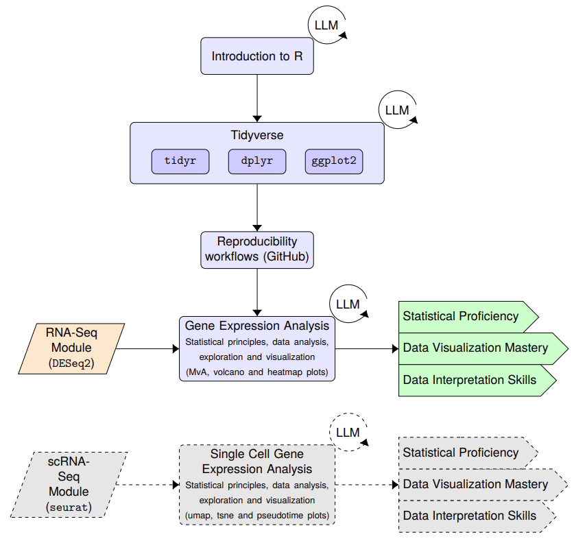

# Lesson Plan Template

## Cloud-based foundations of data analysis, reproducibility and statistical methodologies.

**CSP**: Gogle Cloud

### Overall Learning Objectives:
1. **Introduction to R and Tidyverse**  
   Overview and basic operations in R, including data import/export, data manipulation, and basic statistics.

2. **Version Control with Git and Collaboration with GitLab/GitHub**
   Understanding basic Git operations, repository management, and collaborative workflows using GitLab/GitHub platforms.

3. **Data Manipulation with dplyr**  
   Filtering, arranging, and summarizing data, as well as grouping operations and joining multiple datasets with dplyr.

4. **Data Transformation with tidyr**  
   Reshaping data with tidyr (e.g., pivoting and melting), handling missing values, and nest and unnest operations.

5. **Data Visualization with ggplot**  
   Generation of common plots in genomics and proteomics (e.g., MvA, Volcano and Heatmaps) with ggplot, customizing plot aesthetics, and faceting for multi-panel plots.

6. **Statistical Foundations for Large Data**  
Common data analysis and visualization strategies for genomic data with a focus on fundamental statistical principles. Understanding what's inside the 'black box' of analytic algorithms is critical to students' understanding of their results, and the limitations of those results. We will begin with the RNA-seq module and gradually expand to other existing modules (ATAC-seq) or future modules (scRNA-seq) when they become available.

### Google or AWS Services Proposed:
- Vertex AI for LLM foundation models 
- Vertex AI notebooks -- these images are quite a bit out of date with jupyterlab 3
- GKE Jupyterhub
- Object storage

Options for jupyterlab notebooks on gcloud:

1. Vertex AI notebooks -- outdated, instances are overkill.
2. GCE (vm) running jupyterlab docker container
3. GKE (k8) running jupyterlab docker container
4. GKE (k8) running jupyterhub and handling authentication for eg a class.

These are all pretty clunky starting with a clean slate and cloud account.
Ideally, for our context having a GKE jupyterhub deployment would be great for
dissemination to a class.  As we can control identity management and would already
be deployed for students.  click and go.

## Course Outline

### 1. Submodule 1: Introduction to R and Tidyverse
1. Learning Objectives
   - Understand basic R operations
   - Learn data import/export techniques
   - Grasp fundamental data manipulation concepts
   - Apply basic statistical operations
2. Type of Submodule: Background
3. General outline
   - R basics and jupyter lab environment
   - Data structures in R
   - Reading and writing data
   - Introduction to Tidyverse
4. Dataset used
   - Define here with links if possible (small statistics data set)
5. Cloud Services used
   - GKE Juptyerhub
   - vertex ai llm endpoint

### 2. Submodule 2: Version Control with Git and Collaboration with GitLab/GitHub
1. Learning Objectives
   - Understand the basics of version control and its importance in data science
   - Learn fundamental Git operations (init, add, commit, push, pull)
   - Grasp branching and merging concepts
   - Understand collaborative workflows using GitLab/GitHub (pull requests, issues, etc.)
   - Learn how to integrate Git with R projects
2. Type of Submodule: Background and Practical
3. General outline
   - Introduction to version control and Git
   - Basic Git operations and workflow
   - Branching strategies and conflict resolution
   - Collaborative features of GitLab/GitHub
   - Integrating Git with RStudio/Jupyter Lab
   - Best practices for version control in data science projects
4. Dataset used
   - Sample R project for version control demonstration
5. Cloud Services used
   - GKE Jupyterhub
   - Cloud Source Repositories (optional, for hosting Git repositories)
   - Vertex AI LLM endpoint 

### 3. Submodule 3: Data Manipulation with dplyr
1. Learning Objectives
   - Master data filtering and arrangement
   - Learn to summarize data effectively
   - Understand grouping operations
   - Practice joining multiple datasets
2. Type of Submodule: Analysis
3. General outline
   - dplyr basics: filter(), arrange(), select()
   - Summarizing data: summarize(), group_by()
   - Joining data: left_join(), inner_join(), etc.
4. Dataset used
   - Define here with links if possible (small statistics data set)
5. Cloud Services used
   - GKE Juptyerhub
   - vertex ai llm endpoint

### 4. Submodule 4: Data Transformation with tidyr
1. Learning Objectives
   - Learn data reshaping techniques
   - Master handling of missing values
   - Understand nest and unnest operations
2. Type of Submodule: Analysis
3. General outline
   - Pivoting data: pivot_wider(), pivot_longer()
   - Handling missing data: drop_na(), replace_na()
   - Nesting and unnesting data
4. Dataset used
   - Define here with links if possible
5. Cloud Services used
   - GKE Juptyerhub
   - vertex ai llm endpoint

### 5. Submodule 5: Data Visualization with ggplot
1. Learning Objectives
   - Create common genomics and proteomics plots
   - Customize plot aesthetics
   - Implement multi-panel plots using faceting
2. Type of Submodule: Analysis
3. General outline
   - ggplot basics and grammar of graphics
   - Customizing plot appearance
   - Faceting for multi-panel visualization
4. Dataset used
   - Define here with links if possible (small statistics data set )
5. Cloud Services used
   - GKE Juptyerhub
   - vertex ai llm endpoint

### 6. Submodule 6: Statistical Foundations for Large Data
1. Learning Objectives
   - Understand statistical principles behind genomic and proteomic data analysis
   - Learn to interpret results from analytic algorithms
   - Apply analysis strategies to RNA-seq data
2. Type of Submodule: Background and Analysis
3. General outline
   - Statistical foundations for genomics and proteomics
   - Understanding analytic algorithms
   - RNA-seq data analysis
   - Creating MvA, Volcano, and Heatmap plots
   - Introduction to ATAC-seq and scRNA-seq analysis (if available)
4. Dataset used
   - Define here with links if possible (e.g., RNA-seq dataset)
5. Cloud Services used
   - GKE Juptyerhub
   - vertex ai llm endpoint

