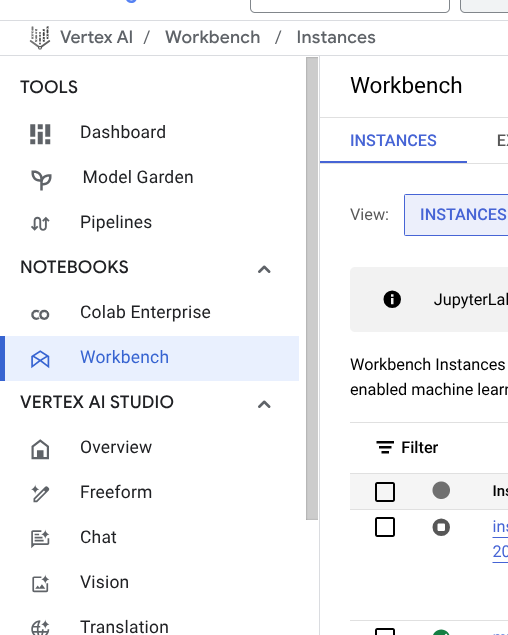
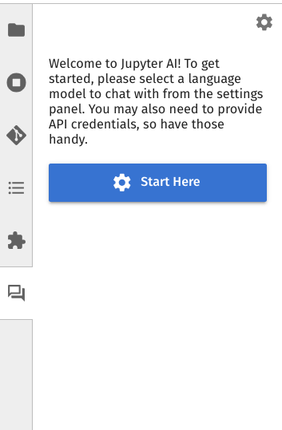
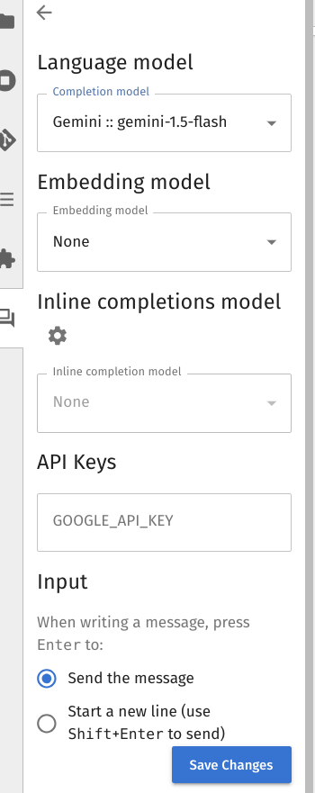

# Setting Up a Jupyter Notebook in Google Cloud Console

## Initial Access
1. Navigate to Google Cloud Console using this URL:  [https://console.cloud.google.com/welcome?project=nigms-nosi-duke](https://console.cloud.google.com/welcome?project=nigms-nosi-duke)
2. In the search bar at the top of the console, type "Vertex AI" and select it from the search results

## Setting Up Vertex AI Workbench
1. Within Vertex AI, locate and select "Workbench" from the available options

2. Click "Create New Instance" to begin setting up your Jupyter environment

## Configuring Your Instance
1. Basic Setup:
   - Provide a meaningful name for your instance
   - Click "Advanced Options" to access additional configuration settings

2. Environment Configuration:
   - Navigate to the "Environment" tab
   - Select "JupyterLab 4" as your development environment

   - Look for the "Startup Script" option

     

   - Click "Browse" to locate the script

   - Navigate to "Duke_store_1"

   - Select the "post_start_clean.sh" script from the available files

3. Machine Configuration:
   - For machine type, the default settings are typically sufficient
   
     
   
   - Important: Ensure "Enable idle shutdown" is checked to avoid unnecessary resource usage

   - Click "Create" at the bottom of the page

## Launching JupyterLab
1. Wait approximately 3-5 minutes for the instance to be fully provisioned
2. Once provisioning is complete, click "Start JupyterLab" to launch the environment

## Setting Up Your Project Repository
1. In JupyterLab, locate and click the Git button in the sidebar

2. Select "Clone a Repository"

3. Enter the following repository URL: https://github.com/mitomac/duke_nigms_sandbox.git
4. Click "Clone" to download the repository

5. Navigate into the project by double-clicking the "duke_nigms_sandbox" folder to access the modules

## Working with notebooks
1. If you're working with R notebooks, you'll be prompted to select a kernel

2. Choose the R kernel when prompted to ensure proper execution of R code

   

## AI Assistant

1. Start the AI  assistant

   

   

   

2. Select a google gemini model

   

3. See internal slack for API key

Additional Tips:
- Keep track of your instance's running time to manage resources effectively

- Save your work regularly

- Consider bookmarking the Google Cloud Console URL for easier access in the future

   
